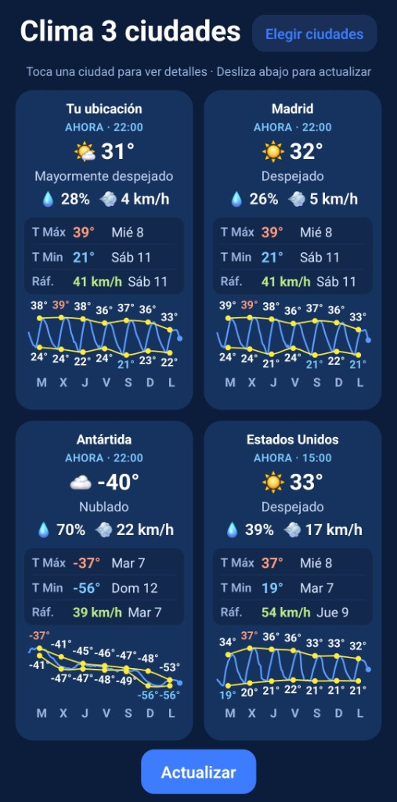
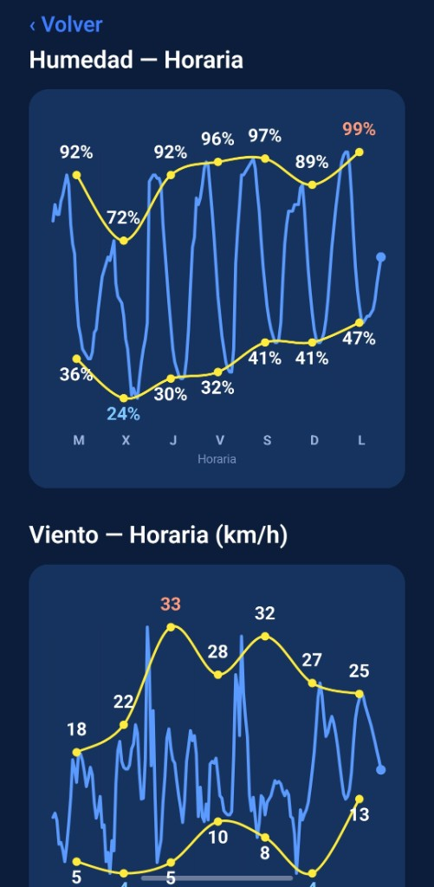

# Clima multiciudad

App de clima para Android con tu ubicación GPS y tres ciudades a elegir. Muestra el tiempo actual, resumen de la semana y gráficas de temperatura, humedad y viento.





## Descargar

Instala la última versión desde [GitHub Releases](https://github.com/ernestocorral-lab/Clima-app/releases/latest):

**[Descargar Clima.apk](https://github.com/ernestocorral-lab/Clima-app/releases/latest/download/Clima.apk)**

En el móvil, abre el archivo y permite instalar apps de fuentes desconocidas si el sistema lo pide.

## Uso

- Toca una **ciudad** para ver el detalle completo (clima actual, pronóstico y gráficas).
- Pulsa **Elegir ciudades** para cambiar las tres ciudades guardadas.
- Pulsa **Actualizar** o **desliza abajo** para refrescar los datos de las cuatro ubicaciones.

## Datos

Información meteorológica de [Open-Meteo](https://open-meteo.com/).

## Desarrollo

```bash
npm install
npm start
```

Para compilar el APK de release, ver el historial del proyecto o la documentación de Expo / React Native.
